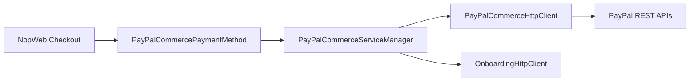
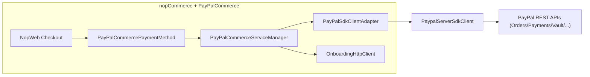

# Migration Plan: PayPalCommerce plugin → PayPal Server SDK v2.0.0

## Goals & Scope

- **Goals**
  - **Adopt the official `PayPalServerSDK` v2.0.0** for all PayPal REST interactions currently implemented via custom HTTP + DTOs in the PayPalCommerce plugin.
  - **Preserve existing checkout behavior and UX** (PayPal buttons, Advanced Cards, Apple Pay, Google Pay, Vault, recurring, messaging, webhooks).
  - **Reduce custom API surface** over time by leaning on the SDK’s typed models and controllers.
- **In-scope APIs** (per package docs): Orders v2, Payments v2, Payment Method Tokens (Vault) v3, Transaction Search v1, Subscriptions v1 ([PayPalServerSDK 2.0.0 on NuGet](https://www.nuget.org/packages/PayPalServerSDK/2.0.0#readme-body-tab)).
- **Out-of-scope (initially)**
  - Onboarding service (`OnboardingHttpClient`) that calls `PayPalCommerceDefaults.Onboarding.ServiceUrl` (Nop’s own backend) – leave as is.
  - Any PayPal endpoints not yet exposed by the v2.0.0 server SDK (e.g., specific Webhook management endpoints if missing).

## Current Architecture (high level)

- **Core pieces**
  - `PayPalCommercePaymentMethod` – payment plugin entry point, delegates to `PayPalCommerceServiceManager` for capture/void/refund/recurring.
  - `PayPalCommerceServiceManager` – main orchestration layer: builds PayPal payloads (Orders, Payments, Vault, Webhooks, alt payment methods) and calls `_httpClient.RequestAsync<TReq,TRes>`.
  - `PayPalCommerceHttpClient` – wraps `HttpClient`, does:
    - OAuth 2 client-credentials (`GetAccessTokenRequest` → `v1/oauth2/token`) with static token cache.
    - Attaches headers (Authorization, `User-Agent`, `PayPal-Request-Id`, `Prefer`, partner header, etc.).
    - Calls REST endpoints using path/method from `IApiRequest`, deserializes into `IApiResponse` DTOs.
  - `Services/Api/**` – custom request/response models for Orders, Payments, Vault (payment tokens), Webhooks, Identity, Authentication, etc., including paths like `v2/checkout/orders`, `v2/payments/authorizations/.../capture`, `v3/vault/*`.
  - `OnboardingHttpClient` – simple `HttpClient` against `PayPalCommerceDefaults.Onboarding.ServiceUrl` (not PayPal API).
- **Flow (simplified)**

## Target Architecture with PayPal Server SDK

- **New central client**
  - Use `PaypalServerSdkClient` from `PayPalServerSDK` ([PayPal .NET Server SDK GitHub](https://github.com/paypal/PayPal-Dotnet-Server-SDK)) configured via builder:
    - `ClientCredentialsAuth` with `PayPalCommerceSettings.ClientId` & `SecretKey`.
    - `Environment` from `PayPalCommerceSettings.UseSandbox ? Environment.Sandbox : Environment.Production`.
    - Optional `LoggingConfig` / `HttpClientConfiguration` for diagnostics.
- **Where the SDK is used**
  - Replace direct REST calls for **Orders**, **Payments**, **Vault Payment Tokens**, and optionally **Transaction Search / Subscriptions**, with calls to the SDK controllers:
    - `OrdersController` – create/update/get orders, tracking.
    - `PaymentsController` – captures, refunds, voids.
    - `VaultController` – setup tokens, payment tokens.
    - `TransactionSearchController` – if reporting/search is added.
    - `SubscriptionsController` – only if/when PayPalCommerce adopts Subscriptions API v1.
- **Integration style**
  - Introduce an **adapter/factory** around `PaypalServerSdkClient` used by `PayPalCommerceServiceManager`.
  - Keep `OnboardingHttpClient` unchanged.
  - Initially keep `PayPalCommerceHttpClient` for any endpoints not yet moved, then phase it out.

## Step 1 – Add PayPalServerSDK NuGet dependency

- **Update project file**
  - In [`src/Plugins/Nop.Plugin.Payments.PayPalCommerce/Nop.Plugin.Payments.PayPalCommerce.csproj`](src/Plugins/Nop.Plugin.Payments.PayPalCommerce/Nop.Plugin.Payments.PayPalCommerce.csproj):
    - Add `<PackageReference Include="PayPalServerSDK" Version="2.0.0" />` under a new or existing `<ItemGroup>` (per NuGet instructions in [PayPalServerSDK 2.0.0 on NuGet](https://www.nuget.org/packages/PayPalServerSDK/2.0.0#readme-body-tab)).
  - Confirm that targeting `net9.0` is compatible with the SDK’s `netstandard2.0` (supported per the package’s framework compatibility matrix).

## Step 2 – Introduce a PayPalServerSDK client factory

- **Create an abstraction**
  - Add a new interface, e.g. `IPayPalServerSdkClientFactory`, in the plugin (e.g. under `Services/`):
    - Method `Task<PaypalServerSdkClient> CreateAsync(PayPalCommerceSettings settings)` or a sync equivalent that reads the current settings.
    - Encapsulate mapping from plugin settings to SDK configuration.
- **Implement the factory**
  - New class (e.g. `PayPalServerSdkClientFactory`) that:
    - Injects `ILogger<...>` for logging and optionally `IHttpContextAccessor` if per-request customisation is needed.
    - Builds `PaypalServerSdkClient` using the builder pattern described in the NuGet README (`ClientCredentialsAuth`, `Environment`, optional `Timeout` & `LoggingConfig`) ([PayPalServerSDK 2.0.0 on NuGet](https://www.nuget.org/packages/PayPalServerSDK/2.0.0#readme-body-tab)).
    - Configures timeout using `PayPalCommerceSettings.RequestTimeout` when present.
- **Register with DI**
  - In [`src/Plugins/Nop.Plugin.Payments.PayPalCommerce/Infrastructure/NopStartup.cs`](src/Plugins/Nop.Plugin.Payments.PayPalCommerce/Infrastructure/NopStartup.cs):
    - Add `services.AddScoped<IPayPalServerSdkClientFactory, PayPalServerSdkClientFactory>();`.
    - Keep the existing `AddHttpClient<OnboardingHttpClient>().WithProxy();`.
    - Optionally keep `AddHttpClient<PayPalCommerceHttpClient>().WithProxy();` during transition.

## Step 3 – Remove manual OAuth handling & align auth model

- **Current behavior**
  - `PayPalCommerceHttpClient.GetAccessTokenAsync` posts `GetAccessTokenRequest` to `v1/oauth2/token`, caches tokens in a static dictionary keyed by `ClientId`, and adds `Bearer` / `Basic` auth headers manually.
- **Target behavior with SDK**
  - Let `PayPalServerSDK` handle OAuth 2 Client Credentials via `ClientCredentialsAuth` supplied to the `PaypalServerSdkClient` builder ([PayPalServerSDK 2.0.0 on NuGet](https://www.nuget.org/packages/PayPalServerSDK/2.0.0#readme-body-tab)).
- **Migration steps**
  - In the **adapter/factory** layer, ensure that the SDK is initialized with the correct client ID/secret and environment from `PayPalCommerceSettings`.
  - For calls migrated to the SDK, **stop using** `GetAccessTokenRequest` / manual headers and rely entirely on the SDK’s internal token management.
  - Keep `PayPalCommerceHttpClient.GetAccessTokenAsync` *only* for any remaining raw HTTP calls (e.g., if Webhook endpoints are not yet supported), and plan to delete it once all calls are SDK-backed.

## Step 4 – Migrate Orders API usage to OrdersController

- **Identify all order-related calls**
  - In [`PayPalCommerceServiceManager`](src/Plugins/Nop.Plugin.Payments.PayPalCommerce/Services/PayPalCommerceServiceManager.cs), find usages of:
    - `CreateOrderRequest` / `CreateOrderResponse` (`v2/checkout/orders`).
    - `GetOrderRequest` / `GetOrderResponse`.
    - `UpdateOrderRequest` (patch: invoice id, shipping info, etc.).
    - `CreateAuthorizationRequest`, `Api.Orders.CreateCaptureRequest`, `CreateTrackingRequest`, and order status polling.
- **Mapping strategy**
  - For each operation, replace `_httpClient.RequestAsync<...>` with a call to the SDK:
    - Use `IPayPalServerSdkClientFactory` to get a configured `PaypalServerSdkClient` from within `PayPalCommerceServiceManager`.
    - Call the appropriate `OrdersController` method (e.g., create/update/get order, add tracking).
    - Map between plugin-level models (`Services/Api/Models` types like `Order`, `Money`, `PurchaseUnit`) and the SDK’s models. Initially this can be done via dedicated mappers to avoid touching higher layers.
- **Incremental approach**
  - Start with **read-only calls** (e.g., `GetOrder`) to validate wiring.
  - Move **order creation/update** once mapping is stable, including support for:
    - Buttons on cart/product/payment method pages (`ButtonPlacement`).
    - Skipping order confirmation (`SkipOrderConfirmPage`).
    - Shipping address and experience context (cancel/return URLs).
  - Ensure error handling (e.g., denied/failed/pending statuses) is equivalent when using SDK response types.

## Step 5 – Migrate Payments (captures, voids, refunds) to PaymentsController

- **Identify payment flows**
  - In [`PayPalCommerceServiceManager`](src/Plugins/Nop.Plugin.Payments.PayPalCommerce/Services/PayPalCommerceServiceManager.cs), locate:
    - `CaptureAuthorizationAsync` – uses `Api.Payments.CreateCaptureRequest` / `CreateCaptureResponse` against `v2/payments/authorizations/{id}/capture`.
    - `VoidAsync` – uses `CreateVoidRequest` against `v2/payments/authorizations/{id}/void`.
    - `RefundAsync` – uses `CreateRefundRequest` / `CreateRefundResponse` against `v2/payments/captures/{id}/refund`.
- **Wire these flows through `PaymentsController`**
  - Within each of the three methods, obtain a `PaypalServerSdkClient` via `IPayPalServerSdkClientFactory`.
  - Use the SDK’s **Payments controller** APIs (see [PayPal .NET Server SDK GitHub](https://github.com/paypal/PayPal-Dotnet-Server-SDK) and the NuGet README for the payment endpoints: Orders v2 / Payments v2 / Vault / Transaction Search / Subscriptions in [PayPalServerSDK 2.0.0 on NuGet](https://www.nuget.org/packages/PayPalServerSDK/2.0.0#readme-body-tab)):
    - Map `CreateCaptureRequest` to the appropriate `Payments` call for capturing an authorization.
    - Map `CreateVoidRequest` to the void-authorization method.
    - Map `CreateRefundRequest` to the capture-refund method.
- **Model mapping**
  - Introduce small mapper helpers (static class or private methods) to convert between:
    - Existing plugin models (`Capture`, `Refund`, `Money`, status enums) in `Services/Api/Models`.
    - SDK models returned from `PaymentsController` (capture/refund resources, statuses, amount objects).
  - Keep the external behavior of:
    - `CaptureAuthorizationAsync` returning `(Capture, string Error)`.
    - `VoidAsync` returning `(bool Result, string Error)`.
    - `RefundAsync` returning `(Refund, string Error)`.
- **Preserve status & error semantics**
  - Ensure checks like:
    - `CaptureStatusType.DECLINED`, `FAILED`, `PENDING`.
    - `RefundStatusType.CANCELLED`, `FAILED`, `PENDING`.
  - Are re-implemented using the SDK response types:
    - Map SDK statuses to your existing enums, or adjust the status comparison layer while leaving error messages the same.
  - Keep the behavior of preventing double refunds by storing refund IDs on orders via generic attributes.

---

## Step 6 – Migrate Vault (Payment Method Tokens) & Recurring to VaultController

- **Identify vault & recurring usage**
  - In `PayPalCommerceServiceManager`, find:
    - `CreateSetupTokenAsync` – builds `CreateSetupTokenRequest` (`v3/vault/setup-tokens`) using `PaymentTokens.CreateSetupTokenRequest`.
    - `CreateRecurringOrderAsync` – uses setup token and Vault to create orders for recurring payments.
    - Token lifecycle methods that call:
      - `CreatePaymentTokenRequest` (`v3/vault/payment-tokens`).
      - `GetPaymentTokensRequest`, `DeletePaymentTokenRequest`, etc.
  - `PayPalTokenService` handles persistence of local token representations (`PayPalToken` entities).
- **Use SDK `VaultController`**
  - For **setup tokens**:
    - Replace `_httpClient.RequestAsync<CreateSetupTokenRequest, CreateSetupTokenResponse>` with a call through `VaultController` (Payment Method Tokens API v3) from the SDK.
    - Map the `CreateSetupTokenRequest` DTO to the SDK’s equivalent request type.
  - For **payment tokens**:
    - Replace manual `CreatePaymentTokenRequest`, `GetPaymentTokensRequest`, `DeletePaymentTokenRequest` calls with SDK-based `Vault` operations.
    - Keep local DB token schema (`PayPalToken`) the same; only change how remote tokens are created/queried/deleted.
- **Recurring billing flow**
  - Preserve how recurring plans are currently modeled:
    - `CreateSetupTokenAsync` currently prepares billing cycles, frequencies, and totals using your own `BillingCycle`, `PricingScheme`, `Frequency`, etc.
  - Initial migration:
    - Reuse the existing plan-building logic but send the resulting structure via SDK models for Payment Method Tokens (Vault v3).
- **Error handling & customer experience**
  - Ensure that:
    - Errors such as “Vault disabled”, missing setup token, missing merchant ID, guest checkout for recurring, etc., are unaffected.
    - Token selection in the UI (e.g., saved cards) remains unchanged; only the server-side API is swapped.

---

## Step 7 – Webhooks, Identity & Transaction Search

- **Webhooks**
  - Existing classes under `Services/Api/Webhooks` handle:
    - Creating webhooks, listing, deleting, and verifying signatures via `CreateWebhookRequest`, `GetWebhooksRequest`, `CreateWebhookSignatureRequest`, etc.
  - Migration approach:
    - Check whether the `PayPalServerSDK` exposes strongly-typed Webhook endpoints in any controller or utility layer.
      - If yes, wrap those via `PaypalServerSdkClient` instead of `_httpClient.RequestAsync<...>`.
      - If not (likely in v2.0.0), keep the current `PayPalCommerceHttpClient` + `Services/Api/Webhooks` implementation for webhook management.
    - In either case, preserve the existing `PayPalCommerceWebhookController` behavior and signature verification logic.
- **Identity / 3DS support**
  - `Services/Api/Identity` and identity token flows are used for strong customer authentication (3DS) with Advanced Card Fields.
  - Since v2.0.0 of `PayPalServerSDK` focuses on **Orders, Payments, Vault, Transaction Search, Subscriptions** ([PayPalServerSDK 2.0.0 on NuGet](https://www.nuget.org/packages/PayPalServerSDK/2.0.0#readme-body-tab)), plan to:
    - Keep the identity-related calls on the legacy `PayPalCommerceHttpClient` for now.
    - Revisit once PayPal extends the Server SDK with those endpoints or provides guidance in [PayPal .NET Server SDK GitHub](https://github.com/paypal/PayPal-Dotnet-Server-SDK).

---

## Step 8 – Update ServiceManager to Use the SDK Adapter Everywhere

- **Introduce a `PayPalSdkClientAdapter`** 
  - Create a class (e.g., under `Services/`) that:
    - Injects `IPayPalServerSdkClientFactory`.
    - Provides high-level methods like:
      - `Task<Order> CreateOrderAsync(...)`
      - `Task<Order> GetOrderAsync(...)`
      - `Task<Capture> CaptureAuthorizationAsync(...)`
      - `Task<Refund> RefundAsync(...)`
      - `Task<SetupToken> CreateSetupTokenAsync(...)`, etc.
  - Internally calls `client.OrdersController`, `client.PaymentsController`, `client.VaultController`, etc.
- **Refactor `PayPalCommerceServiceManager`**
  - Replace direct usage of `_httpClient.RequestAsync<TReq, TRes>` with calls to the adapter:
    - Orders section → `PayPalSdkClientAdapter` order methods.
    - Payments section → adapter capture/void/refund methods.
    - Vault/recurring section → adapter vault methods.
  - Keep all **business rules**, nopCommerce interactions, and error/warning messages in `PayPalCommerceServiceManager`, only swapping out the low-level API layer.
- **Maintain public surface**
  - Ensure that the public methods used by:
    - `PayPalCommercePaymentMethod`,
    - `PayPalCommerceModelFactory`,
    - `PayPalCommercePublicController`,
  - Keep exactly the same interfaces and semantics (return types, error strings, flags like `LoginIsRequired`, `CheckoutIsEnabled`, etc.).

---

## Step 9 – Gradual Deletion of Custom API DTOs & HttpClient

- **Flag unused API DTOs**
  - After Orders/Payments/Vault have been fully migrated to the SDK:
    - Use IDE tooling to find references to classes under `Services/Api/**`:
      - Orders, Payments, PaymentTokens, Authentication, Identity, Webhooks.
  - For those fully replaced by SDK models:
    - Mark them as deprecated (internal comments) in an interim branch.
    - Remove them only after confirming all references are gone.
- **Phase out `PayPalCommerceHttpClient`**
  - Once:
    - OAuth2 token retrieval (`GetAccessTokenRequest`) is no longer called directly.
    - All supported endpoints (Orders, Payments, Vault, any others covered by the SDK) use `PaypalServerSdkClient`.
  - Remove:
    - The `PayPalCommerceHttpClient` class.
    - Its registration in [`NopStartup`](src/Plugins/Nop.Plugin.Payments.PayPalCommerce/Infrastructure/NopStartup.cs), if no other code depends on it.
  - If Webhooks/Identity still rely on it:
    - Keep a slimmed-down version that is scoped only to those remaining calls, documented as a temporary compatibility layer.

---

## Step 10 – Testing, Validation & Rollout

- **Unit & integration tests**
  - Add tests around `PayPalCommerceServiceManager` for:
    - Order creation/update flows (different `ButtonPlacement` values, `SkipOrderConfirmPage`, shipping vs no shipping).
    - Capture, void, refund flows with different statuses (COMPLETED, PENDING, FAILED, DECLINED).
    - Vault token creation, retrieval, deletion, and recurring payment flows.
  - Where practical, mock `IPayPalServerSdkClientFactory` / the adapter to validate mapping without real network calls.
- **Sandbox verification**
  - In a sandbox environment:
    - Exercise end-to-end:
      - Express checkout buttons (cart, product, payment method page).
      - Advanced credit/debit cards with SCA/3DS prompts.
      - Apple Pay / Google Pay (if configured).
      - Saved payment methods (Vault) and recurring payments.
      - Webhooks: creation, event receipt, and signature validation.
    - Compare results (statuses, order notes, transaction IDs, refunds) with the pre-migration behavior.
- **Production rollout**
  - Plan a **phased rollout**:
    - Deploy behind a feature flag or configuration toggle if possible (e.g., “Use PayPal Server SDK”).
    - Monitor:
      - Payment success/failure rates.
      - Webhook delivery and processing.
      - Error logs from the SDK (using `LoggingConfig` in the client builder per [PayPalServerSDK 2.0.0 on NuGet](https://www.nuget.org/packages/PayPalServerSDK/2.0.0#readme-body-tab)).
  - Document:
    - New dependency (`PayPalServerSDK` v2.0.0).
    - Any configuration caveats (timeouts, logging verbosity).
    - Any changed operational runbooks for support teams.